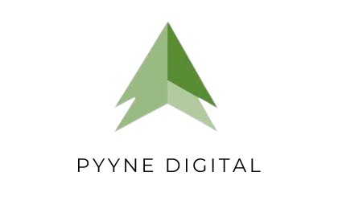

<h1 align="center">
    
</h1>


<p align="center">Challenge project using python;.</p>

<p align="center">
  

  
  
  <a href="https://github.com/RicardoTaverna/pyyne/commits/main">
    
  </a>

  
   <a href="https://github.com/RicardoTaverna/pyyne/stargazers">
    
  </a>

  
</p>

<p>
  <a href="https://wakatime.com/badge/user/18404a95-9303-4021-afd5-7b42235d38a0/project/e6b2b9a4-1e9a-4827-9d32-b0ab8246fee8"></a>
  <p>
    <a href="https://wakatime.com/@ricardotaverna/projects/pkvpxcakdl?start=2022-10-06&end=2022-10-12" target="_blank">Time spent on project</a>
  </p>
</p>

## 💻 Table of Contents

* [About](#about)
* [Table of Contents](#💻-table-of-contents)
* [Technologies](#🛠-technologies)
* [Project](#🚀-project)
    * [Requirements](#requirements)
    * [Implementation/Running](#runnig)
    * [Tests](#tests)
* [Licence](#📝-licence)

## 🛠 Technologies
- <a href="https://www.python.org">
    
</a>

## 🚀 Project

### Requirements
- Start creating a new python environment after clone the project, inside the main folder:
```bash
pip install virtualenv

python -m virtualenv .venv
```

- Install the adicional libraries
```bash
pip install -r requirements.txt
```

### Runnig
- To run the project, You can use the python command or the bash script:
```bash
python main.py
```

```bash
bash run.sh
```

### Tests
- To run the tests You can use either the python command or the bash script:
```bash
# to check the docstyles
python -m pydocstyle main.py

# to check code quality
python -m pycodestyle --config=.pycodestyle  main.py
python -m pycodestyle --config=.pycodestyle  pyynechallengebank
python -m mypy main.py

# to run the tests
python -m unittest -v .\tests\adapter_test.py
```

```bash
bash run-tests.sh
```


## 📝 licence

This project is under MIT licence.

<p align="center">Made with ❤️ by Ricardo Taverna</p>